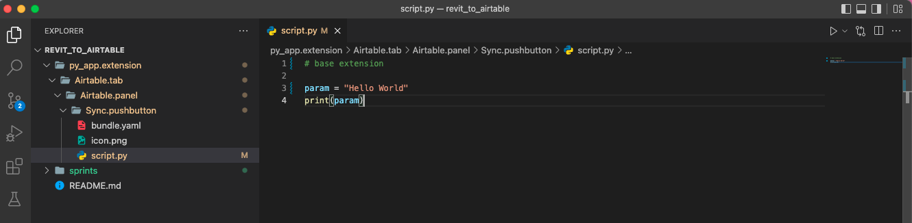
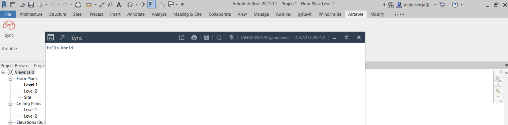

# Sprint One

### Create the plugin structure for a base application in pyRevit.

Create a folder structure, py scripts, icons, and yaml files. You can find great icon on ICON8.

---

Put in some really simple code to test out app in Revit to see that it works
```python
# base extension

param = "Hello World"
print(param)
```
---

Test it... okay, it is up and running

---


### Write a basic functions to extract rooms and print them in the PyRevit output

### Write function for a put request through NoCodeAPI