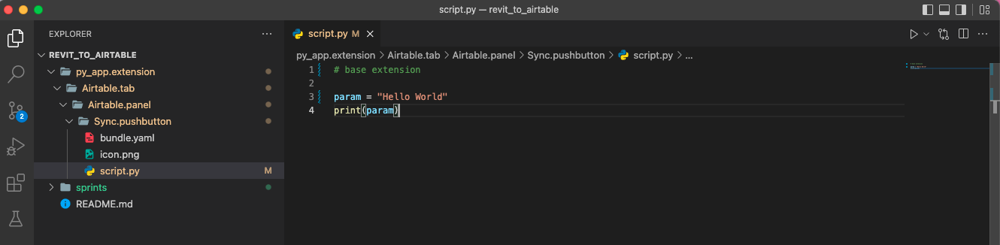
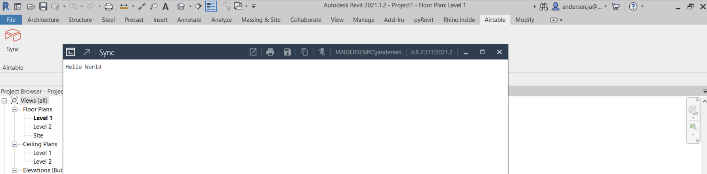
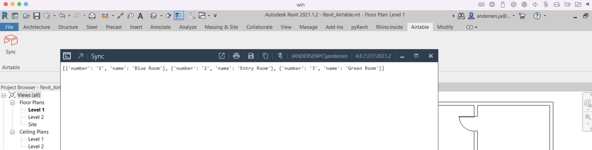

## Sprint One
### Create the plugin structure for a base application in pyRevit.

Basic folder structure, py scripts, icons, and yaml files. Find great selection of royalty free icons on [ICON8](https://icons8.com/icons).



Write some really simple code to test out the app in Revit to see that it works.
```python
# base extension

param = "Hello World"
print(param)
```


Test it... okay, it is up and running.


---
<br>

### Write a basic functions to extract rooms and print them in the PyRevit output
Replace our previous script with one that imports [Revit Python Wrapper](https://revitpythonwrapper.readthedocs.io/en/latest/) from [pyRevit](https://www.notion.so/pyrevitlabs/pyRevit-bd907d6292ed4ce997c46e84b6ef67a0). The create a collector of all rooms in the model.
```python
# pyRevit
from pyrevit import DB
import rpw

revitRoomCollector = rpw.db.Collector(of_category=DB.BuiltInCategory.OST_Rooms, is_not_type=True)
```

Now that all rooms rae in ```revitRoomCollector``` loop through and make a dictionary of each rooma nd store that in a list.
```python
def roomInfo(collector):
    roomInfo = []
    for e in collector:
        roomInfo.append({'name': e.Parameter[DB.BuiltInParameter.ROOM_NAME].AsString(), 'number': e.Number})
    return roomInfo
```

print rooms in pyRevit window by instantiating the definition feeding it teh room collector. 
```python
print(roomInfo(revitRoomCollector))
```



---
<br>

### Write function for a put request through NoCodeAPI
Set up NoCodeAPI account

Create post command

Enjoy