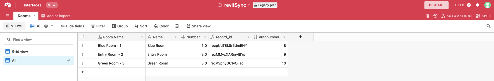

## Sprint One
### Create the plugin structure for a base application in pyRevit.

Basic folder structure, py scripts, icons, and yaml files. Find great selection of royalty free icons on [ICON8](https://icons8.com/icons).


Write some really simple code to test out the app in Revit to see that it works.
```python
# base extension

param = "Hello World"
print(param)
```


In the main pyRevit tab connect in your new *py_app.extension* as outlined [here](https://www.notion.so/Create-Your-First-Command-2509b43e28bd498fba937f5c1be7f485) 
Then test it... great, we are up and running!


---
<br>

### Write a basic function to extract rooms then print them in the PyRevit output window:
Replace our previous script with one that imports: 
- ```Autodesk.DB``` from [pyRevit](https://www.notion.so/pyrevitlabs/pyRevit-bd907d6292ed4ce997c46e84b6ef67a0)
- [Revit Python Wrapper](https://revitpythonwrapper.readthedocs.io/en/latest/)
- Then create a filtered element collector containing all rooms in the model.

```python
# pyRevit
from pyrevit import DB
import rpw

revitRoomCollector = rpw.db.Collector(of_category=DB.BuiltInCategory.OST_Rooms, is_not_type=True)
```

Now that all rooms are in ```revitRoomCollector``` loop through it and make a dictionary of each room and store that in a list.
```python
def roomInfo(collector):
    roomInfo = []
    for e in collector:
        roomInfo.append({'name': e.Parameter[DB.BuiltInParameter.ROOM_NAME].AsString(), 'number': e.Number})
    return roomInfo
```

print the room information in pyRevit window by instantiating the definition and supplying the room collector as the input. 
```python
print(roomInfo(revitRoomCollector))
```

And here we have it.


---
<br>

### Write a function for a *POST* request through [NoCodeAPI](https://nocodeapi.com/).
I have been using NoCodeAPI since beginning of 2021 for prototyping, or in making really fast MVP's. I find it great for this task, teh free tier is generous and the breadth of access to tools is large and expanding all the time. 

Establish an airtable base with the same columns from your model export, make sure the column headings are correct; case & datatype-sensitive! In my case I am only pulling 'name' & 'number' from Revit, all other columns here are for general airtable stuff (we will cover more of this in later posts).


Set up a NoCodeAPI account and your airtable API's on the platform.


When that is done you can test the API calls in the NoCodeAPI UI, this also gives you an example of code to use in your app.


Now, lets update our pyRevit app with the following code, switch the previous ```print``` to a variable containing the room information.
```python
airtableData = roomInfo(revitRoomCollector)
```

Then add the code from NoCodeAPI, updating the ```data = airtableData``` line.
```python
url = "https://v1.nocodeapi.com/jrandersen/airtable/NBknQBAnYLitRlTH?tableName=rooms"
params = {}
data = airtableData
r = requests.post(url = url, params = params, json = data)
result = r.json()
print(result)
```

Now, make sure you save, go ahead and press Sync, and Enjoy!


You now have use the API to move information from Revit -> Airtable.



### Conclusions
Sprint one is meant to get people up and running, fast. There are most certainly major issue with this workflow such as:
- hard-coding api calls into the base code.
- the application does not 'remember' or 'know' if a certain model has been harvested, so it will just keep adding more and more rooms.

In the next tutorials, we will clean up some of this on our way to making this a more robust application.

Hope folks find this helpful.