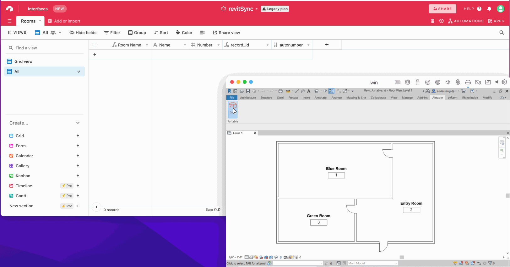

## Sprint One
### Create the plugin structure for a base application in pyRevit.

Basic folder structure, py scripts, icons, and yaml files. Find great selection of royalty free icons on [ICON8](https://icons8.com/icons).


Write some really simple code to test out the app in Revit to see that it works.
```python
# base extension

param = "Hello World"
print(param)
```


Test it... okay, it is up and running.


---
<br>

### Write a basic function to extract rooms then print them in the PyRevit output window:
Replace our previous script with one that imports: 
- ```Autodesk.DB``` from [pyRevit](https://www.notion.so/pyrevitlabs/pyRevit-bd907d6292ed4ce997c46e84b6ef67a0)
- [Revit Python Wrapper](https://revitpythonwrapper.readthedocs.io/en/latest/)  

Then create a filtered element collector containing all rooms in the model.
```python
# pyRevit
from pyrevit import DB
import rpw

revitRoomCollector = rpw.db.Collector(of_category=DB.BuiltInCategory.OST_Rooms, is_not_type=True)
```

Now that all rooms are in ```revitRoomCollector``` loop through it and make a dictionary of each room and store that in a list.
```python
def roomInfo(collector):
    roomInfo = []
    for e in collector:
        roomInfo.append({'name': e.Parameter[DB.BuiltInParameter.ROOM_NAME].AsString(), 'number': e.Number})
    return roomInfo
```

print the room information in pyRevit window by instantiating the definition and supplying the room collector as the input. 
```python
print(roomInfo(revitRoomCollector))
```

And here we have it.


---
<br>

### Write function for a put request through NoCodeAPI
Get an airtable base up and running with teh same columns from your model export, make sure the names are correct (case-sensitive) & data types are in line.


Set up a NoCodeAPI account and your airtable API's.


When that is done you can test the API calls in teh NoCodeAPI UI, this also gives you the code to use in your app.


```python
airtableData = roomInfo(revitRoomCollector)

url = "https://v1.nocodeapi.com/jrandersen/airtable/NBknQBAnYLitRlTH?tableName=rooms"
params = {}
data = airtableData
r = requests.post(url = url, params = params, json = data)
result = r.json()
print(result)
```

Enjoy
