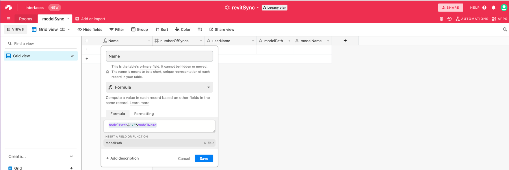

# Sprint Two

### Establish an environments 'like' file, and update API endpoints
Now that we have a basic connection, let's start refining. At the same level as your ```.extension``` folder add a ```*your_extensions_name*.lib``` folder. Inside of that library folder create a file called ```env.py``` , then in that file put the following:
```
# NoCodAPI endpoints

# airtable base:
REVIT_SYNC="YOUR_NOCODE_API_ENDPOINT_IS_HERE"
```
Once all the files are saved, I would recommend navigating back to pyRevit ribbon and *reload* so that the library folder is recognized.


Your folder structure should look something like this now. 


Now navigate back to your ```script.py``` file and add the import for the env file.
```python
import env
```

Then in your POST request update the url to.
```python
url = env.REVIT_SYNC
```

We have one last part, update the ```.gitignore``` file so that we *do NOT* push this env file to github. Once that is done, the file should be greyed out in the folder structure. Now this local environments file that can hold centralized information that will not get out. When distributing the app remember to walk your users through setting this file up, some repos do this in their main install instructions.

Environment variables can get somewhat complex with dev and production credentials, deployment options to users etc, but this tutorial is meant to be an entry point for people, so the goal is to demonstrate concepts first. 

### Some app clean up and re-factoring
As next steps here, I have added a ```harvest.py``` & ```airtable.py``` to the library folder. This starts to encapsulate some similar classes and functions. In the harvest file I have added
```python
from pyrevit import DB
import rpw

# room info
def roomInfo():
    roomInfo = []
    revitRoomCollector = rpw.db.Collector(of_category=DB.BuiltInCategory.OST_Rooms, is_not_type=True)   
    for e in revitRoomCollector:
        roomInfo.append({
            'Name': e.Parameter[DB.BuiltInParameter.ROOM_NAME].AsString(),\
             'Number': int(e.Number)})
    return roomInfo
```

and to the airtable file I have added:
```python
import requests

def postData(url, data):
    r = requests.post(url = url, params = {}, json = data)
    result = r.json()
    return result
```

Notice that I moved all the imports there too. This significantly cleans up the main ```script.py``` file in the Revit ribbon too, as it is just calling to functions in other files:
```python
# pyRevit
from pyrevit import forms

# our library files
import env, harvest, airtable

# use pyRevit forms to show progress.
with forms.ProgressBar(title='Exporting room data Aitable base', indeterminate=True):
 
    # instantiate def, get room info
    airtableData = harvest.roomInfo()

    # do a basic post request to airtable through nocode api
    postRoomData = airtable.postData(env.REVIT_SYNC, airtableData)

    print(postRoomData)
```
### Establish a sync table in AirTable.
Now is time to set up a sync table, create one called ```modelSync```. In there create columns: 
- numberOfSyncs 
- userName 
- modelPath 
- modelName 
Then make the first column a formula that concatenates both the path & model ```modelPath&"/"&modelName```. We will use this to identify our model for now.




### Write functions to manage sync events