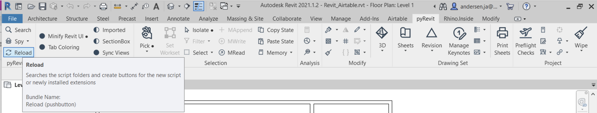
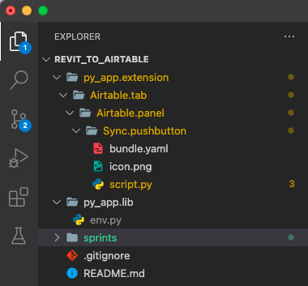

# Sprint Two

### Establish an environments 'like' file, and update API endpoints
Now that we have a basic connection, let's start refining. At the same level as your ```.extension``` folder add a ```*your_extensions_name*.lib``` folder. Inside of that library folder create a file called ```env.py``` , then in that file put the following:
```
# NoCodAPI endpoints

# airtable base:
REVIT_SYNC="YOUR_NOCODE_API_ENDPOINT_IS_HERE"
```
Once all the files are saved, I would recommend navigating back to pyRevit ribbon and *reload* so that the library folder is recognized.



Your folder structure should look something like this now. 



Now navigate back to your ```script.py``` file and add the import for the env file.
```python
import env
```

Then in your POST request update the url to.
```python
url = env.REVIT_SYNC
```

We have one last part, update the ```.gitignore``` file so that we *do NOT* push this env file to github. Once that is done, the file should be greyed out in the folder structure. Now this local environments file that can hold centralized information that will not get out. When distributing the app remember to walk your users through setting this file up, some repos do this in their main install instructions.

Environment variables can get somewhat complex with dev and production credentials, deployment options to uses etc, but this tutorial is meant to be an entry point for people, so the goal is to demonstrate concepts first. 

### Establish a sync table in AirTable.

### Write functions to manage sync events